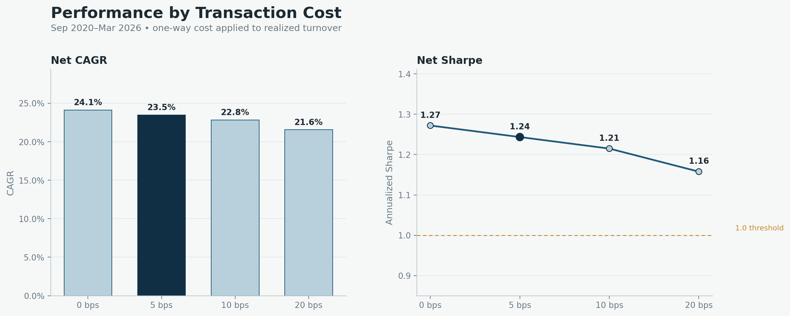
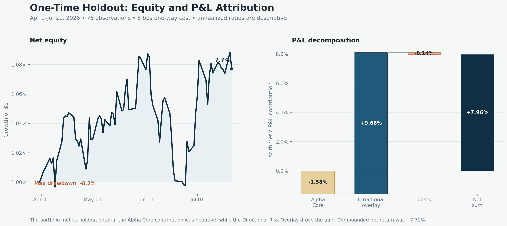

# Evidence and Limitations

## Development evidence

| Measure | Reviewed result |
|---|---:|
| Window | 2020-09-01 to 2026-03-26 |
| One-way transaction-cost assumption | 5 bps |
| CAGR | 23.49% |
| Annualized Sharpe | 1.24 |
| Maximum drawdown | -16.10% |

The result is also evaluated under higher linear transaction-cost assumptions.
At 20 bps one-way cost, annualized Sharpe is 1.16.

For the market-neutral Alpha Core, the reviewed development diagnostics include
a 0.94 Sharpe and 0.0059 realized beta to the supplied market reference.

## Robustness coverage

The development result was challenged across transaction costs, nine nearby
configurations, ten deterministic 80% stock subsets, single-sector exclusions,
three random seeds, and three training-window lengths. The stock-subset checks
had a minimum 20.55% CAGR and 1.095 Sharpe; every single-sector exclusion
remained profitable.

A deflated Sharpe probability estimate and block bootstrap were also reviewed.
The bootstrap 2.5th percentile was 10.10% CAGR with -31.24% drawdown, showing
why parameter stability and path uncertainty should not be treated as the same
claim. See [Research Lineage](docs/RESEARCH_LINEAGE.md) for the full map.

## One-time holdout

The 76-session holdout returned +7.71%, with 1.39 annualized Sharpe and -8.23%
maximum drawdown. These figures describe a short evaluation window and should
not be treated as a long-run performance estimate.

## Sleeve-level P&L attribution

| Holdout component | Arithmetic contribution |
|---|---:|
| Alpha Core | -1.58% |
| Directional Risk Overlay | +9.68% |
| Transaction costs | -0.14% |

The two sleeve contributions are arithmetic gross P&L, while transaction costs
are a deduction. Their simple arithmetic sum is +7.96%. The reported holdout
return compounds daily net returns and is therefore +7.71% rather than +7.96%.

The attribution shows which portfolio decision drove the holdout result. It
does not establish a pure alpha-versus-beta factor decomposition because the
overlay adds exposure across Alpha Core long names rather than trading a pure
market instrument.

## Interpretation boundaries

- The universe is a fixed, retrospectively curated set of 174 U.S. large-cap
  equities, so survivorship and membership-selection bias remain.
- Results are simulated from daily adjusted bars; intraday path and execution
  uncertainty are not reconstructed.
- The cost model is linear and does not capture nonlinear market impact,
  financing, borrow availability, taxes, or capacity constraints.
- A 76-session holdout is useful as a one-time research check but is too short
  to establish long-run stability.
- Reported beta is measured against the supplied market reference and does not
  rule out other common-factor or regime exposures.
- The public reference code demonstrates the research contracts on synthetic
  inputs; it did not generate the reported evidence.

These limits define what the project supports: a reviewable research process,
portfolio construction logic, and honest component attribution—not a live or
independently audited track record.
