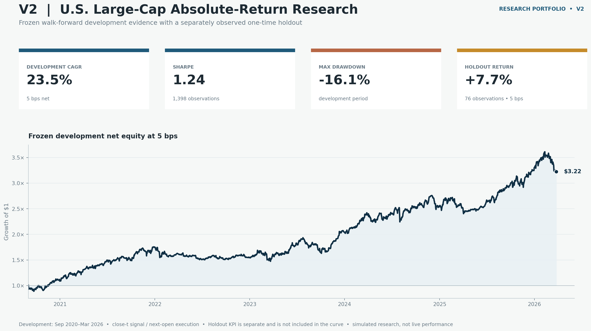
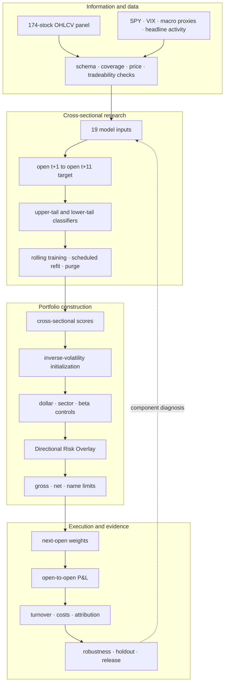

# Systematic Equity Alpha

## Separating market-neutral stock selection from directional risk

An end-to-end U.S. large-cap absolute-return research system combining
cross-sectional modelling, purged walk-forward evaluation, constrained
portfolio construction, regime-aware risk control, next-open execution, and
sleeve-level P&L attribution.

> All results are simulated. The study uses a fixed, retrospectively curated
> universe of 174 U.S. large-cap equities rather than historical point-in-time
> index membership.

## Research summary

- **Question:** Can relative stock-selection signals be translated into an
  absolute-return portfolio without confusing security selection with
  directional market exposure?
- **Design:** Build a dollar-, sector-, and estimated-beta-controlled Alpha
  Core, then govern directional risk in a separate overlay that does not change
  the stock ranking.
- **Evidence:** The fixed development specification produced 23.49% CAGR and
  1.24 Sharpe after 5 bps one-way costs; Sharpe remained 1.16 at 20 bps.
- **Finding:** A one-time holdout returned +7.71%, but sleeve attribution showed
  that the Directional Risk Overlay drove the gain while the Alpha Core
  detracted.

`174 equities` · `19 model inputs` · `1,398 development sessions` ·
`4 transaction-cost assumptions` · `76-session holdout`



## Headline evidence

| Evidence | Reviewed result |
|---|---:|
| Development, 5 bps one-way cost | 23.49% CAGR · 1.24 Sharpe · -16.10% maximum drawdown |
| Development cost stress, 20 bps | 21.57% CAGR · 1.16 Sharpe |
| Market-neutral Alpha Core, development | 0.94 Sharpe · 0.0059 realized beta to SPY |
| One-time holdout, 76 sessions | +7.71% · 1.39 annualized Sharpe · -8.23% maximum drawdown |
| Holdout sleeve attribution | Alpha Core -1.58% gross · Directional Risk Overlay +9.68% gross |

The combined portfolio result and the stock-selection result are not the same
claim. The development period supports the fixed system specification; the
short holdout supports the combined portfolio only over that later window; the
holdout attribution leaves the Alpha Core's independent stability unresolved.

## How the evidence is organized

| Evidence layer | Question it answers | Role in the conclusion |
|---|---|---|
| Development | What did the fixed research design produce over the main sample? | Establishes the primary performance and risk profile |
| Cost sensitivity and robustness | Does the result disappear under nearby assumptions or samples? | Tests dependence on one convenient specification |
| One-time holdout | What happened after the design was fixed? | Adds later, non-development observations |
| Sleeve attribution | Which portfolio decision generated the result? | Separates combined performance from component stability |


The sections below follow this chain from problem definition to evidence and
interpretation.

## 1. Research question

A cross-sectional model can rank securities correctly while the resulting
portfolio still earns most of its return from a broad market exposure. For an
absolute-return objective, model accuracy, portfolio neutrality, directional
risk, and implementation cost must therefore be treated as connected but
distinct research problems.

The project asks three linked questions:

1. Can upper- and lower-tail stock outcomes be estimated using only information
   available at each decision time?
2. Can those estimates be converted into a market-neutral stock-selection
   sleeve after sector, beta, concentration, and turnover controls?
3. Can directional exposure be governed separately so that total portfolio P&L
   remains attributable to the decision that created it?

## 2. Research decomposition

The portfolio is represented as two separately governed sleeves:

```text
combined portfolio weights
    = market-neutral Alpha Core weights
    + Directional Risk Overlay weights
```

The Alpha Core expresses relative stock selection. The Directional Risk Overlay
changes aggregate exposure in response to market state but leaves the
cross-sectional ranking unchanged.

The same separation is maintained in the return ledger:

```text
combined net P&L
    = Alpha Core gross P&L
    + Directional Risk Overlay gross P&L
    - transaction costs
```

This decomposition shapes the data timing, model evaluation, portfolio checks,
and final interpretation. A positive combined return cannot automatically be
described as standalone stock-selection alpha.

## 3. End-to-end system



The result is the output of connected research contracts rather than a single
model score. A valid run requires agreement across the information, modelling,
portfolio, execution, accounting, and evidence layers.

## 4. Information set and data controls

The research panel aligns constituent OHLCV with market and contextual inputs.

| Input group | Role in the system |
|---|---|
| Constituent OHLCV | Stock-level features, volatility, liquidity, labels, and tradable returns |
| SPY | Market return, trend, volatility, and beta reference |
| VIX | Market stress and overlay risk scaling |
| Rates and credit proxies | Macro and risk-condition context |
| Sector proxy | Cross-sectional context and exposure diagnostics |
| Headline activity | Event-intensity context without publishing licensed text |

Before model evaluation, the full implementation checks schema, duplicate keys,
price bounds, coverage, tradeability, date alignment, and file identity. The
public reference implementation exposes the cross-sectional schema,
uniqueness, finite-value, and information-time contracts using synthetic data.

The fixed universe is an explicit limitation. It makes the experiment
reproducible but introduces survivorship and membership-selection bias; no
claim is made that the universe reproduces historical index membership.

## 5. Features, labels, and the information clock

The model matrix contains 19 inputs: 11 stock-factor families plus market,
rates, credit, sector-proxy, and headline-activity variables. Exact feature
definitions and transformations are not published.

Two horizons must remain distinct:

```text
decision and execution
    features observed after close t
    -> portfolio decision formed from the close-t information set
    -> execution at open t+1
    -> daily P&L from open t+1 to open t+2

model target
    decision at t
    -> forward return from open t+1 to open t+11
```

The longer prediction target creates unresolved labels near every evaluation
boundary. Training therefore ends early enough for all training labels to
resolve before testing begins. The effective separation is 11 sessions, and an
overlapping split is treated as invalid rather than merely discouraged.

## 6. Cross-sectional model

The modelling stage treats the upper and lower cross-sectional tails as
different classification problems. Each side combines LightGBM with an
L2-regularized logistic model. This retains nonlinear interactions while
providing a structurally different model component.

```text
observable feature panel
    -> upper-tail probability
    -> lower-tail probability
    -> combined relative-opportunity score
    -> daily cross-sectional ranking
```

The dual-tail formulation avoids assuming that the mechanisms associated with
potential winners and potential losers must be symmetric.

## 7. Purged walk-forward design

| Design element | Fixed research choice |
|---|---|
| Prediction problem | Separate classification of upper and lower return tails |
| Executable target | Open `t+1` to open `t+11` forward return |
| Model combination | Deterministic LightGBM/L2-logistic ensemble for each tail |
| Training history | Rolling 1.5-year window |
| Refit schedule | Every 63 sessions |
| Label separation | Effective 11-session purge |
| Score schedule | Refreshed on every feature date |
| Score stabilization | Exponentially weighted smoothing |

The refit schedule and score schedule are intentionally different. Models are
refitted periodically, while daily cross-sectional scores are refreshed using
the most recent fitted state and currently available features.

Each evaluation step therefore follows the same order:

```text
resolve eligible training labels
    -> enforce purge before the test boundary
    -> fit or reuse the scheduled model state
    -> score the current cross-section
    -> pass scores to portfolio construction
```

## 8. Alpha Core construction

The stock-selection sleeve is built as a sequence of portfolio operations:

```text
upper-tail probability and lower-tail probability
    -> combined cross-sectional ranking
    -> long and short opportunity sets
    -> inverse-volatility starting weights
    -> dollar-neutral projection
    -> sector-neutral projection
    -> estimated-beta-neutral projection
    -> gross and single-name controls
    -> scheduled rebalance and target smoothing
```

Neutrality is evaluated before the directional sleeve is applied. This keeps a
failure in stock-selection portfolio construction from being hidden by the
overlay.

| Portfolio diagnostic | Purpose |
|---|---|
| Net exposure | Detect unintended directional exposure in the Alpha Core |
| Gross exposure | Control total long-plus-short capital usage |
| Sector exposure | Prevent the ranking from becoming a sector allocation |
| Estimated beta exposure | Reduce dependence on broad market direction |
| Single-name exposure | Limit concentration in one security |
| Turnover | Connect target changes to implementation cost |

## 9. Directional Risk Overlay

The Directional Risk Overlay is formed only after the Alpha Core has passed its
own exposure checks. SPY trend, realized volatility, and VIX govern aggregate
net exposure. The overlay does not rerank stocks and does not directly trade a
market ETF or futures contract. It adds exposure across securities already in
the Alpha Core long book, subject to final gross, net, and single-name limits.

This structure allows the two decisions to be governed and measured separately,
but it is not a pure statistical alpha-versus-beta factor decomposition. The
term “sleeve-level P&L attribution” is used because it matches the actual
portfolio construction.

## 10. Execution, turnover, and P&L accounting

The execution convention is designed together with the label rather than added
after modelling:

```text
information available after close t
    -> target weights for open t+1
    -> realized portfolio return from open t+1 to open t+2
```

One-way turnover is defined as half the cross-sectional absolute change in
weights:

```text
turnover_t = 0.5 × Σ |weight_t - weight_(t-1)|
cost_t     = turnover_t × one_way_cost_bps / 10,000
```

Every period must satisfy the accounting identity:

```text
Alpha Core gross P&L
  + Directional Risk Overlay gross P&L
  - transaction costs
  = combined net P&L
```

The same realized turnover is evaluated at 0, 5, 10, and 20 bps. This isolates
cost sensitivity from changes in model or portfolio decisions.

## 11. Evaluation protocol and research controls

Development, robustness, and holdout evidence have different roles. The
development period is used to establish the specification; robustness checks
challenge its dependence on nearby choices; the holdout is evaluated only
after the research design is fixed.

| Failure mode | System control | Observable output |
|---|---|---|
| Future information enters a decision | Timestamped information set | Decision-clock validation |
| A forward label overlaps evaluation | Label resolution plus purge | Walk-forward split validation |
| Model output drops part of the universe | Full cross-sectional coverage check | Score-schema failure |
| Alpha Core carries directional exposure | Dollar and estimated-beta checks | Exposure report |
| Ranking becomes sector allocation | Sector neutrality check | Per-sector exposure report |
| Overlay changes security selection | Overlay restricted to existing long names | Separate sleeve weights |
| Trading assumptions and returns use different intervals | Shared next-open convention | Execution audit |
| Reported return cannot be reconstructed | Period-level sleeve and cost ledger | Exact reconciliation gap |
| A result depends on one cost assumption | Fixed turnover under four cost levels | Cost-sensitivity curve |
| Holdout alters the chosen design | Specification fixed before evaluation | Separate holdout evidence |

## 12. Development evidence

The primary development window spans 2020-09-01 through 2026-03-26.

| One-way cost | CAGR | Annualized Sharpe | Maximum drawdown | Total return |
|---:|---:|---:|---:|---:|
| 0 bps | 24.14% | 1.27 | -15.68% | 231.89% |
| **5 bps** | **23.49%** | **1.24** | **-16.10%** | **222.39%** |
| 10 bps | 22.85% | 1.21 | -16.73% | 213.17% |
| 20 bps | 21.57% | 1.16 | -17.97% | 195.50% |

At the primary 5 bps assumption, 90.06% of available rolling 252-session
returns were positive and four of five complete calendar years were profitable.
The separately measured Alpha Core produced a 0.94 Sharpe and 0.0059 realized
beta to the supplied SPY reference.


## 13. Robustness evidence

Robustness checks ask whether the development result depends on a single
convenient specification. They reduce selection risk but do not eliminate
sampling uncertainty.

| Dimension varied | Reviewed outcome |
|---|---|
| One-way transaction cost | Sharpe remained 1.16 at 20 bps |
| Nearby parameter grid | All nine configurations were profitable |
| Deterministic 80% stock subsets | Ten subsets; minimum CAGR 20.55%, minimum Sharpe 1.095 |
| Single-sector exclusions | Every exclusion remained profitable |
| Random seed | Seeds 7, 42, and 137 met the point-estimate criteria |
| Training window | 1.0, 1.5, and 2.0 years met the point-estimate criteria |
| Multiple-testing adjustment | Deflated Sharpe probability estimate 90.64% across ten recorded trials |
| Block bootstrap | 2.5th percentile: 10.10% CAGR and -31.24% drawdown |

The bootstrap tail is materially weaker than the point estimate. This is not a
contradiction: nearby-specification stability and path uncertainty measure
different sources of risk.

## 14. One-time holdout evidence

The research design was fixed before the 2026-04-01 to 2026-07-21 holdout. No
parameter was changed after observing this window.

| One-way cost | Total return | Annualized Sharpe | Maximum drawdown |
|---:|---:|---:|---:|
| **5 bps** | **7.71%** | **1.39** | **-8.23%** |
| 10 bps | 7.56% | 1.37 | -8.25% |
| 20 bps | 7.27% | 1.32 | -8.29% |

The annualized ratios are descriptive because the holdout contains only 76
sessions. They should not be treated as long-run performance estimates.


## 15. Sleeve-level attribution

| Holdout component | Arithmetic contribution |
|---|---:|
| Alpha Core gross P&L | -1.58% |
| Directional Risk Overlay gross P&L | +9.68% |
| Transaction costs | -0.14% |
| Arithmetic net sum | +7.96% |
| Compounded portfolio return | +7.71% |

The two sleeve contributions are arithmetic sums of daily P&L. The reported
portfolio return compounds daily net returns, so +7.96% and +7.71% are not
expected to match exactly.

The attribution identifies which portfolio decision drove the holdout. It does
not claim that the overlay is a pure market-beta instrument or that returns have
been decomposed into statistical alpha and beta.

## 16. Interpretation and next research question

The evidence supports a fixed, cost-aware portfolio process with explicit
timing, exposure, and accounting controls. Development performance remains
positive across the reviewed cost levels and nearby robustness checks. The
one-time holdout also produced a positive combined return.

The component evidence is less conclusive. Alpha Core performance was positive
during development but negative during the short holdout, while the Directional
Risk Overlay generated the holdout gain. The next valid test is therefore not
another adjustment to the observed holdout. It is to wait for genuinely new
data and examine whether the fixed Alpha Core resumes positive contribution.

## 17. Executable reference architecture

The repository includes a standard-library Python implementation of the
cross-layer contracts on synthetic inputs:

```text
public_reference/
├── data_contracts.py       # cross-sectional schema and availability
├── contracts.py            # information clock and walk-forward purge
├── research_pipeline.py    # end-to-end sequencing and protected interfaces
├── portfolio_layers.py     # neutrality, exposure, and sleeve composition
├── accounting.py           # turnover, transaction costs, and P&L
├── audit.py                # cross-layer decision audit record
└── walkthrough.py          # synthetic end-to-end execution

tests/
├── test_data_contracts.py
├── test_public_reference.py
└── test_research_pipeline.py
```

The pipeline keeps three research components behind explicit interfaces:

```text
observable feature panel
    -> [private cross-sectional scorer]
    -> validated full-universe scores
    -> [private Alpha Core constructor]
    -> validated neutral weights
    -> [private directional policy]
    -> validated overlay target
    -> public execution, accounting, and audit contracts
```

This boundary preserves the private feature transformations, fitted models,
portfolio optimizer, thresholds, and run artifacts. The surrounding code is
executable rather than decorative pseudocode: private components cannot bypass
the public checks on timing, coverage, neutrality, turnover, or reconciliation.

Run the synthetic walkthrough and 13 tests from the repository root:

```bash
python -m public_reference.walkthrough
python -m unittest discover -s tests -v
```

## 18. Evidence boundaries

- The universe is fixed and retrospective, so survivorship and
  membership-selection bias remain.
- Daily adjusted bars do not reconstruct intraday execution paths.
- Linear transaction costs do not capture nonlinear market impact, financing,
  borrow availability, taxes, or capacity constraints.
- Realized beta to SPY does not rule out other common-factor or regime exposure.
- A 76-session holdout is too short to establish long-run stability.
- The public reference code demonstrates research contracts on synthetic
  inputs; it did not generate the reported performance.

These boundaries limit the claims that can be made from the evidence. They do
not change the reported development or holdout results.

## 19. Repository map

| Path | Contents |
|---|---|
| [`RESEARCH_NOTE.md`](RESEARCH_NOTE.md) | Research question and core design decisions |
| [`EVIDENCE_AND_LIMITATIONS.md`](EVIDENCE_AND_LIMITATIONS.md) | Metrics, attribution, robustness, and interpretation limits |
| [`docs/SYSTEM_DESIGN.md`](docs/SYSTEM_DESIGN.md) | Stage-by-stage system specification |
| [`docs/RESEARCH_LINEAGE.md`](docs/RESEARCH_LINEAGE.md) | Decision chain and evidence lineage |
| [`public_reference/`](public_reference/) | Executable synthetic reference architecture |
| [`tests/`](tests/) | Data, timing, portfolio, pipeline, and accounting tests |
| [`DISCLOSURE.md`](DISCLOSURE.md) | Public/private implementation boundary |

[← Jing Li — Quantitative Research](https://github.com/Jing-Lavinia)
