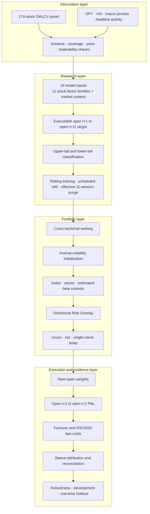

# System Design

## Scope

The project connects cross-sectional equity research to an executable
absolute-return portfolio. Its complexity comes from the contracts between
stages: information must be available, labels must be resolved, portfolio
constraints must survive composition, and every reported return must reconcile
to positions, costs, and portfolio sleeves.



## 1. Information and data contracts

The input layer aligns constituent OHLCV with a market reference, VIX, macro
proxies, and headline activity. Before research begins, it checks schema,
duplicate keys, price bounds, coverage, tradeability, and source identity.

The fixed set of 174 large-cap equities is deliberately described as a
retrospective universe. It is not presented as historical point-in-time index
membership.

## 2. Features, labels, and the information clock

The research matrix contains 19 inputs: 11 stock-factor families plus market,
rates, credit, sector-proxy, and headline-activity context. Exact feature
definitions remain private, but their timing contract is public.

```text
features observed after close t
    -> decision based only on the close-t information set
    -> execution at open t+1
    -> daily portfolio P&L from open t+1 to open t+2

model target for a decision at t
    -> forward return from open t+1 to open t+11
```

Because the model target extends beyond one session, a simple chronological
split is insufficient. Training ends early enough for every training label to
resolve before the evaluation boundary. The resulting effective purge is 11
sessions.

## 3. Cross-sectional model and walk-forward evaluation

The model treats the upper and lower return tails as different classification
problems. Each side combines a nonlinear tree model and a regularized linear
model, then produces a cross-sectional score.

The development design uses a rolling 1.5-year training window, scheduled
63-session refits, daily score refreshes, and deterministic configuration. This
separates the expensive model-fit schedule from the daily portfolio-decision
schedule while preserving out-of-sample ordering.

The public repository exposes the timing and orchestration contracts, not the
fitted models, feature transformations, selection thresholds, or artifacts.

## 4. Alpha Core construction

Cross-sectional scores are translated into a long-short sleeve in several
steps:

1. select both tails of the ranked opportunity set;
2. initialize positions using inverse volatility;
3. project dollar, sector, and estimated beta exposure toward neutrality;
4. apply gross-exposure and single-name controls;
5. schedule rebalancing and smooth target changes.

The important output is not only a weight vector. Each decision also produces
an exposure report that can fail the research run when a required constraint is
violated.

## 5. Directional Risk Overlay

The overlay is governed after the Alpha Core is formed. Market trend, realized
volatility, and VIX determine the amount of additional directional exposure.
It does not rerank securities and does not directly trade SPY; it distributes
additional long exposure across names already selected for the Alpha Core long
book.

This is why the project uses sleeve-level P&L attribution rather than claiming
a pure statistical alpha-versus-beta decomposition.

## 6. Execution, costs, and accounting

The simulator applies prior holdings and next-open target weights to the same
return interval. One-way turnover is half the cross-sectional absolute weight
change. Linear cost scenarios of 0, 5, 10, and 20 bps are applied to realized
turnover.

For every interval, the accounting identity is checked:

```text
Alpha Core gross P&L
  + Directional Risk Overlay gross P&L
  - transaction costs
  = combined net P&L
```

The arithmetic sleeve contributions are kept separate from the compounded
portfolio return so that two different aggregation concepts are not silently
mixed.

## 7. Evidence lifecycle

The system distinguishes three kinds of output:

| Output | Purpose |
|---|---|
| Development evidence | Select and understand the fixed research design |
| Robustness evidence | Test sensitivity to cost, sample, sector, seed, and training-window choices |
| One-time holdout | Evaluate the fixed design once on later observations |

The holdout is not folded back into model selection. Its sleeve attribution is
retained because it changes the interpretation even when the total portfolio
meets its criteria.

## Public implementation boundary

| Public and executable | Kept private |
|---|---|
| Data-shape and availability contracts | Licensed source data and ingestion adapters |
| Information-clock and purge invariants | Exact feature transformations |
| Pipeline interfaces and control flow | Fitted models and serialized artifacts |
| Exposure and composition checks | Production optimizer and private thresholds |
| Turnover, cost, and P&L reconciliation | Full experiment notebooks and run caches |
| Synthetic walkthrough and tests | Operational research infrastructure |

The boundary preserves the research logic and its failure conditions without
representing the public code as the implementation that generated the reported
results.
